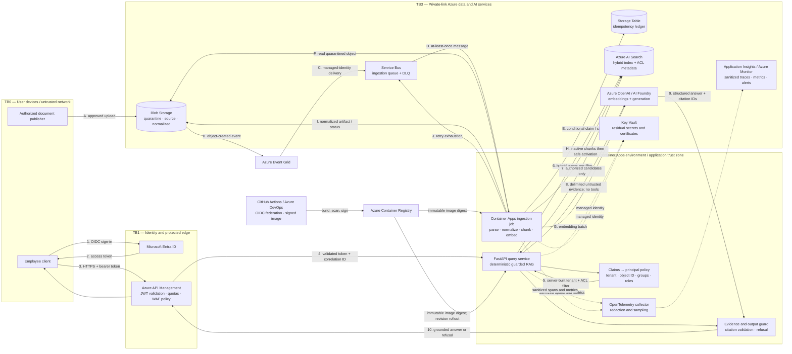

# Production architecture

This document describes how the runnable FastAPI reference implementation evolves into a secure Azure service. The local mode deliberately uses deterministic adapters so reviewers can run and test the important policy behavior without cloud credentials. Production replaces those ports with Azure AI Search and Azure OpenAI adapters; it does not replace the workflow or its security invariants.

The design optimizes for a defensible answer with traceable evidence. A useful refusal is a successful outcome when evidence or authorization is inadequate.

## Architectural invariants

1. **Authorization precedes disclosure.** Tenant, lifecycle and ACL filters execute within retrieval. Unauthorized chunks never enter application candidates, reranking, prompts, model context, logs or citations.
2. **Retrieved content is data, never instruction.** The model receives delimited, source-labeled evidence and has no Search connection, tool registry, managed identity or secret access.
3. **No evidence means no answer.** Relevance/coverage gates, citation validation and conflict handling can return typed refusals. Fluent unsupported text is never the fallback.
4. **Every artifact is versioned.** Source, parser, chunker, embedding, index schema, prompt, model deployment, policy and output schema versions are attributable in evaluation and traces.
5. **The workflow is bounded.** The query path is a deterministic state machine with explicit call, token, latency and retry budgets. There is no autonomous agent loop.
6. **Blob is the document system of record.** Azure AI Search is a rebuildable serving index; partial ingestion cannot make a document version visible.
7. **Production uses identity, not embedded credentials.** Workloads use separate managed identities and least-privilege data-plane roles. Public PaaS endpoints are disabled.

Related decisions are recorded in [ADR 0001](adr/0001-hybrid-retrieval.md), [ADR 0002](adr/0002-structure-aware-chunking.md), [ADR 0003](adr/0003-deterministic-workflow.md) and [ADR 0004](adr/0004-azure-ai-search.md). The detailed security analysis is in [the threat model](threat-model.md).

## Deployment and trust boundaries

The editable Mermaid source is [architecture.mmd](architecture.mmd).



| Boundary | Trust transition | Enforcement |
|---|---|---|
| TB0 → TB1 | An untrusted device asks to become an authenticated employee | Entra conditional access/MFA; APIM TLS, token validation, size limits and quotas |
| TB1 → TB2 | An edge-validated request enters application compute | FastAPI validates the JWT again against pinned issuer/audience/algorithms; client identity headers are ignored in production |
| TB2 → TB3 | A workload accesses enterprise data or a model | Private endpoints, private DNS, workload-specific managed identity and least-privilege RBAC |
| Search → API → model | Untrusted indexed text approaches a probabilistic model | Pre-retrieval ACL filter, injection signals, delimited context, no tools, structured output and citation validation |
| Publisher → ingestion | User-controlled file becomes searchable enterprise evidence | Publisher authorization, quarantine, file/type limits, malware scan, safe parser, trusted ACL catalog and inactive-first indexing |
| Workload → telemetry | Sensitive processing emits operational data | OpenTelemetry allowlist/redaction; content is excluded; restricted diagnostic sampling is separate and opt-in |

## Component responsibilities

| Component | Responsibility | Explicitly does not do |
|---|---|---|
| APIM | Validate Entra tokens, enforce request/rate quotas, attach/propagate W3C trace context, expose a stable API | Decide document ACLs or inject trusted user identity via unsigned headers |
| FastAPI query service | Revalidate identity, derive a principal, run the guarded workflow, apply budgets, validate output | Parse arbitrary search filters, hold admin keys, or allow the model to invoke tools |
| Azure AI Search | Execute ACL-prefiltered lexical/vector retrieval and optional semantic reranking | Act as source of record or make authorization policy decisions from document prose |
| Azure OpenAI / AI Foundry | Create query/document embeddings and generate schema-constrained answers | Retrieve documents, resolve identities or possess workload credentials |
| Blob Storage | Retain immutable source versions, normalized artifacts and processing diagnostics | Serve searchable answers directly |
| Event Grid + Service Bus | Convert source events to durable, at-least-once work with backpressure and a DLQ | Provide exactly-once processing |
| Container Apps ingestion job | Safely parse, clean, chunk, embed, index, reconcile and report state | Trust embedded macros/links/instructions or activate partial versions |
| Storage Table ledger | Conditional idempotency claims and ingestion state | Store document content or replace audit logs |
| OpenTelemetry + Application Insights | Correlate sanitized spans, metrics, error categories and cost estimates | Store raw prompts/chunks by default |

Azure Container Apps is chosen over AKS for this bounded HTTP service and event-driven worker: revision traffic splitting, managed ingress and KEDA scaling cover the requirements with less cluster ownership. AKS becomes appropriate if the platform later needs custom GPU scheduling, service-mesh policy, specialized model serving or many tightly coupled services.

## Online query flow

### 1. Authenticate and derive a principal

The client obtains an Entra access token for the API audience. APIM rejects invalid issuer, audience, signature, algorithm, expiry and not-before claims. The API repeats cryptographic validation using cached OIDC metadata/JWKS and pins the tenant policy; defense in depth prevents a routing/configuration mistake at the edge from becoming an authorization bypass.

The policy layer maps only validated claims to an immutable principal:

```text
tenant_id, object_id, app_roles, transitive_group_ids,
authentication_strength, token_issued_at, correlation_id
```

Production never accepts caller-supplied `user`, `department`, `role`, `group` or `tenant` headers. Local mode may create deterministic principals for demonstrations, but that adapter must be impossible to select in a production configuration. Prefer stable Entra app roles and group object IDs to display names. If group-overage claims require a directory lookup, resolve them through a least-privilege membership service with a short bounded cache; failure is fail-closed, not “no groups means public plus guessed department.”

### 2. Validate and classify the request

FastAPI/Pydantic enforces schema, length and character limits before any provider call. A deterministic policy classifier identifies unsupported operations, obvious credential-exfiltration requests and exact navigation/metadata queries. It is not the primary injection defense and it does not grant access. User-provided Search filter expressions, index names, model names, prompt templates and tool choices are not API inputs.

### 3. Construct authorization inside retrieval

The server combines the principal with trusted index metadata to create an Azure AI Search OData predicate. Conceptually:

```text
tenant_id eq <validated tid>
and is_active eq true
and (
  visibility eq 'company'
  or allowed_principal_ids/any(p: p eq <validated oid>)
  or allowed_group_ids/any(g: search.in(g, <validated group IDs>))
)
```

Values are encoded by a typed filter builder; no user text is concatenated into filter syntax. The vector query uses `vectorFilterMode=preFilter`. Keyword, vector, fusion and semantic ranking therefore operate only over authorized candidates. Application-side checks validate returned tenant/ACL metadata again as a tripwire, but they are not the security boundary.

### 4. Retrieve, fuse and gate evidence

The retriever runs BM25 and vector search in one hybrid request; Azure fuses ranks and, when enabled, semantically reranks the filtered top candidates. The service then:

- collapses overlap and exact duplicate content;
- caps per-document dominance so repeated chunks do not masquerade as corroboration;
- applies document authority, effective date and active-version policy;
- retains chunk ID, title, section/page, source URI, immutable version and component/reranker scores; and
- evaluates relevance, evidence coverage and conflict signals against thresholds calibrated on the evaluation set.

Search scores are not probabilities. Thresholds are versioned by query class and must be calibrated again when the analyzer, embedding, index, semantic ranker or corpus changes. A low-confidence or poor-match retrieval returns `insufficient_evidence`; a high score alone never authorizes an answer.

### 5. Handle versions and contradictions

Only active versions are normally eligible. Citations always expose the immutable document version and effective date. If multiple authorized, active, similarly authoritative sources make incompatible claims, the system returns `conflict` with both evidence sets and asks for an owner/date clarification; it does not let the model silently choose. A configured authority hierarchy (for example, approved policy over a knowledge article) may resolve a conflict only when that hierarchy is enterprise-owned metadata, not an inference from wording.

### 6. Construct untrusted context and generate

The prompt is assembled from a versioned system template plus a minimal question and authorized evidence. Each chunk is wrapped with machine-generated IDs and explicit data delimiters. Instructions inside evidence are quoted as content. The system prompt says what the model may do, but the architectural controls remain decisive: no unauthorized content, no tools, no credentials, no arbitrary URLs and bounded output/tokens.

The selected Azure OpenAI deployment receives a structured-output schema. Generation temperature is low for reproducibility, but temperature is not treated as a hallucination control. The model returns a status, concise answer, and cited chunk IDs.

### 7. Validate and respond

The guard verifies the schema, allowed status, output length and that every citation ID was present in the supplied context. Sentences requiring evidence must have citations; a lightweight entailment/claim check can be evaluation-gated in production. One bounded schema-repair attempt is allowed only when the provider succeeded but formatting failed. Unsupported citations, unsafe output or unresolved evidence failures become a typed refusal.

The public response contains a correlation ID, status/reason code, answer when allowed, and source objects with document/version/section/page—not raw internal scores unless an authorized debug role requests a separately audited diagnostic view.

## Ingestion and document lifecycle

### Event and state model

1. An authorized publisher uploads to a tenant-scoped quarantine container using a short-lived, write-only path or governed portal. ACL, authority, retention and effective-date metadata come from the trusted catalog/publishing workflow, never from document prose.
2. Blob creation emits an Event Grid event. Event Grid delivers with managed identity to Service Bus. Service Bus provides backpressure, retry and DLQ semantics.
3. The worker validates a minimal event envelope and resolves the canonical Blob version; it does not trust event-supplied paths outside the configured account/container/tenant prefix.
4. It conditionally claims the idempotency key `(tenant, blob version ID, content SHA-256, processing-profile version)` in Storage Table using an ETag/insert-if-absent operation.
5. A sandboxed parser validates magic bytes, size/page/decompression limits, rejects active content, and records parse/OCR/table quality. Malware or low-quality documents are quarantined for review.
6. The canonical block model is normalized and chunked according to [ADR 0002](adr/0002-structure-aware-chunking.md). ACL and provenance fields are copied to every chunk.
7. Embeddings are batched with bounded concurrency. All chunks for the new immutable document version are indexed as inactive and verified by count/content hash.
8. The worker activates the version and retires the prior version using security-biased ordering. When an ACL is tightened, old chunks are deactivated first, accepting a short availability gap. For ordinary content replacement, both versions can briefly coexist and query-time version collapse prefers the newest completed version.
9. The ledger transitions to `ACTIVE`; only then is the Service Bus message completed. Retry exhaustion moves the message to the DLQ with content-free diagnostics and alerts an operator.

State transitions are monotonic:

```text
RECEIVED → PROCESSING → INDEXED_INACTIVE → ACTIVE
                  └──→ RETRYABLE_FAILED → PROCESSING
                  └──→ QUARANTINED / DEAD_LETTERED
```

Duplicate delivery reads `ACTIVE` and acknowledges without embedding or indexing again. A crashed lease may be reclaimed after its expiry using a conditional ledger update. Partial chunks remain `is_active=false` and a reconciler removes or completes them. Deletes are tombstoned first, hidden from query, then purged subject to retention/legal-hold policy.

Azure AI Search is eventually consistent and does not provide a transaction spanning all chunks. This design makes the limitation explicit. For large corpus-wide schema/embedding migrations, build a new index, validate/evaluate it, and atomically switch an index alias or application configuration rather than mutate the serving index in place.

### Serving index fields

| Field family | Examples | Search behavior |
|---|---|---|
| Security | `tenant_id`, `visibility`, `allowed_principal_ids`, `allowed_group_ids` | Filterable, never derived from content |
| Lifecycle | `document_id`, `document_version`, `is_active`, `effective_from`, `effective_to`, `authority` | Filterable/sortable for active-version and conflict policy |
| Retrieval | `title`, `section_path`, `content`, `content_vector`, `block_type` | Searchable/vector-searchable with versioned analyzer/profile |
| Citation | `chunk_id`, `source_uri`, `page_start`, `page_end`, `content_hash` | Retrievable; immutable lineage |
| Reproducibility | `parser_version`, `chunker_version`, `embedding_model_version`, `index_schema_version` | Filterable/retrievable for migrations and evaluation |

ACL metadata is denormalized intentionally: authorization can run in Search without a join. A control-plane reconciliation job compares the trusted catalog to index ACL hashes and alerts/deactivates on divergence.

## Reliability and predictable failure behavior

Initial budgets below are hypotheses to validate with load tests, not promises copied into an SLO. The request has one end-to-end deadline; a retry cannot outlive the remaining budget.

| Failure | Timeout/retry policy | Safe behavior / fallback |
|---|---|---|
| Query embedding timeout or transient `429/5xx` | Short connect/read timeout; at most two jittered attempts honoring `Retry-After` | Use keyword-only retrieval only if policy enables it, mark the path degraded, and apply a stricter evidence gate; otherwise `503` |
| Azure AI Search unavailable/timeout | Bounded attempts within retrieval budget; circuit breaker prevents a retry storm | Fail closed with retryable `503`; never use a stale unscoped result cache |
| Semantic ranker failure | No repeated expensive loop | Return hybrid results under a stricter threshold and emit `reranker_degraded`; ACL filtering remains intact |
| LLM timeout | At most one retry before response and only with enough deadline; honor `Retry-After` | Typed `dependency_unavailable`; do not synthesize from memory. An approved same-residency deployment may be a circuit-breaker fallback |
| LLM rate limit | Admission control plus bounded exponential backoff/jitter | Shed low-priority generation, route eligible simple requests to an evaluated smaller deployment, or return `429/503` with retry guidance |
| Malformed model output | One schema-repair attempt under the original budget | Refuse with `invalid_model_output`; never forward raw output |
| Embedding failure during ingestion | Retry individual bounded batch; checkpoint completed work | New version stays inactive; message retries then DLQ; prior authorized version remains available unless ACL revocation required deactivation |
| Parser/partial ingestion failure | Deterministic retry from immutable Blob source | Inactive partial chunks are invisible; diagnostics identify failed stage; reconciler cleans them |
| Duplicate event / worker crash | Conditional idempotency claim and lease | Resume or acknowledge completed key; no duplicate active content |
| Telemetry backend unavailable | Bounded in-process/exporter queue, sampling and drop counters | User path continues; never block indefinitely or spill sensitive payloads to ad hoc files |
| Key Vault/control-plane interruption | Managed identity for normal data-plane access; cache only non-secret configuration with TTL | Running revisions continue where safe; new secret-dependent operations fail closed |

Provider calls classify failures into timeout, throttle, transient service, permanent input/policy and authentication/configuration errors. Only transient classes retry. Circuit breakers are per dependency/deployment, not global. Bulkheads separate query and ingestion concurrency so a document spike cannot exhaust interactive request capacity.

Candidate service objectives:

- 99.9% monthly availability for authenticated query requests, excluding client/policy refusals;
- p95 end-to-end answered request under 6 seconds and p95 no-model refusal under 2 seconds;
- 99% of responses with a terminal typed status and correlation ID;
- zero known cross-tenant/ACL leakage, with any violation treated as a severity-one incident; and
- p95 successful ingestion-to-searchability under 5 minutes for supported documents below the published size limit.

## Scaling and cost

Query API and ingestion worker deploy and scale independently. Container Apps keeps at least two query replicas across zones where supported and scales on HTTP concurrency; the worker scales with KEDA Service Bus queue depth, capped to respect embedding/index quotas. APIM applies per-client and tenant quotas before expensive calls.

For Azure AI Search, replicas increase query throughput/availability; partitions increase storage and indexing throughput. Capacity changes follow measured query latency, throttling, storage and indexing queues. For Azure OpenAI, token-per-minute and request-per-minute quotas are likely to saturate before CPU in the FastAPI containers. Admission control, token limits, prompt compaction, embedding batching, deployment quotas and cost-aware routing matter before “add more containers.”

At 10× traffic and 10× documents, expected pressure appears in this order:

1. model TPM/concurrency and semantic-ranker throughput;
2. Search partition storage/indexing load, then replica query load;
3. ingestion backlog and embedding throughput;
4. application/telemetry volume; and
5. ACL collection/filter complexity for users with very large group sets.

Mitigations are quota/load tests, separate model deployments by workload, smaller evaluated routes, Search capacity or tenant sharding, batch embedding, queue backpressure, trace sampling, and app-role/entitlement compaction. Sharding is introduced only with a routing and rebalancing plan; it is not a substitute for relevance tuning.

Cost is attributed per tenant/query class/model and includes prompt/completion tokens, embedding calls, semantic-ranker use, Search capacity, Container Apps compute and telemetry ingestion. Alerts cover daily budget burn and anomalous tokens per answer. Response caching is off by default for sensitive answers. If enabled, its key includes tenant, entitlement hash, normalized query, active corpus generation, policy/prompt/model versions and expiry; cache hits still require current authorization.

## Model-routing strategy

The reference path exposes a model port and a deterministic local implementation; operating several production deployments is a proposed evolution, not a fabricated implementation claim.

| Route | Signals | Benefit | Primary risk/control |
|---|---|---|---|
| No LLM | Exact source navigation/metadata, policy denial, inadequate evidence, or extractive response already supported verbatim | Lowest latency/cost and strongest predictability | Do not force genuinely synthesizing questions into brittle templates |
| Small hosted model (for example, evaluated mini/Phi deployment) | Simple single-source answer, low conflict/complexity, bounded evidence, non-exception sensitivity | Lower cost and latency | Route only query classes that pass correctness/groundedness gates |
| Frontier hosted model | Multi-source synthesis, complex comparison, higher reasoning score, conflicts that need explanation | Best expected quality | Higher cost/latency; strict context, token and timeout budgets still apply |
| Private open-source model on Azure ML/managed compute | Data class prohibits hosted route, stable high-volume task justifies operations, model meets evaluation | Privacy/control and possibly marginal cost at scale | GPU capacity, patching, serving, safety and quality become team-owned |

Routing signals are deterministic metadata and measured features: task class, evidence count/diversity, conflict/authority flags, requested output complexity, sensitivity/residency policy, tenant tier, latency budget and provider health. User text cannot select an unrestricted deployment. Every route has a minimum evaluation score, maximum cost and rollback configuration. A shadow comparison may gather quality data without returning the candidate answer.

Fine-tuning/LoRA is not the first remedy for missing facts: enterprise knowledge remains in retrieval. Consider PEFT for a stable task/format only after prompt/retrieval baselines and a governed training dataset show a persistent gap. Training data lineage, memorization/privacy testing and model registry promotion would then be mandatory.

## Observability, evaluation and privacy-safe logging

OpenTelemetry propagates one trace across:

```text
APIM → authenticate/principal → policy → query_embedding
→ search.keyword+vector → semantic_rerank → evidence_gate
→ prompt_build → model_generate → output_validate → response
```

Ingestion traces cover event receipt, idempotency claim, download, parse, chunk, embed batches, index, activation and settlement. W3C trace IDs become the response correlation ID and Service Bus diagnostic property.

Useful allowlisted attributes include tenant hash, query-class enum, authorization-filter hash/version, selected route/deployment version, prompt version, returned chunk IDs/content hashes, component scores, candidate counts, token counts, estimated cost, refusal/reason code, retry count, provider status class and durations. Metrics include:

- request, retrieval, reranking, model and end-to-end latency histograms;
- input/output/embedding tokens and estimated cost counters;
- answer/refusal/conflict/insufficient-evidence rates;
- retrieval `Recall@k`, `MRR`, `nDCG@k`, no-relevant-result and ACL-leak test rate from labeled evaluation;
- citation precision/coverage, groundedness and answer correctness from offline/quality sampling;
- provider errors, timeouts, throttles, circuit state and fallback route;
- ingestion stage duration, backlog age, duplicate count, quarantine and DLQ depth; and
- index ACL reconciliation drift and stale-version counts.

Normal logs and traces never contain access tokens, raw questions, prompt text, chunk content, generated answers, source SAS URLs, user email/name or document titles that may themselves be sensitive. The telemetry processor uses an attribute allowlist and recursive key/value redaction before export; token-like/secret patterns provide a second layer, not the primary policy. IDs are salted/hash-pseudonymized where direct operational lookup is unnecessary.

Restricted content sampling, if the privacy owner approves it, goes to a separate encrypted store with explicit user/tenant policy, minimal sample rate, short retention, private endpoint, audited just-in-time RBAC and deletion workflow. It is not Application Insights logging. Dashboards and alerts use aggregate telemetry. This reduces leakage but also limits post-hoc debugging; an authorized diagnostic replay uses the immutable source and version metadata instead.

Evaluation is both offline and operational. A versioned dataset covers answerable, unanswerable, ambiguous, conflicting, unauthorized, injected and poor-match cases. CI blocks promotion on security violations and configured regression deltas, while latency/cost budgets run in a controlled integration environment. Production quality samples detect corpus/model drift; they do not silently train on employee questions. See the repository evaluation report and dataset for exact runnable metrics.

## Azure security and operations

### Identity, authorization and secrets

- APIM and the API use separate Entra application identities. Human/admin access uses groups, PIM and audited elevation.
- Query API managed identity receives Search read/query and model-invoke scope only. Ingestion identity receives Blob read/write to its containers, Service Bus receiver, ledger contributor, Search index-data write and embedding invoke. Neither gets subscription Owner/Contributor.
- CI uses GitHub/Azure DevOps OIDC workload federation; there are no long-lived deployment secrets.
- Key Vault stores only residual third-party secrets/certificates/configuration that cannot use Entra. Secret URIs, not values, are configuration. Rotation is rehearsed; access is logged.
- Search admin keys, storage account keys and model keys are disabled/unused where managed identity is supported.

### Network and data boundaries

APIM exposes the only public API surface. Container Apps uses internal/private ingress reachable from APIM, with egress restricted through the VNet. Search, OpenAI, Storage, Service Bus, Key Vault, ACR and monitoring use private endpoints/private DNS where supported; public network access is disabled. NSGs/firewall rules and Azure Policy prevent accidental public endpoints and require TLS. Egress is deny-by-default except explicit Azure service dependencies; the model cannot originate arbitrary network calls.

Production resources are provisioned in the approved geography. Source, replicas/backups, Search, model deployments, telemetry and support/export paths are reviewed as a set—choosing one regional resource is not sufficient for residency. Tenant data classification controls eligible model routes. Customer-managed keys are used when policy requires them, with an availability/rotation plan. Retention, legal hold, export and purge cascade through Blob artifacts, index chunks, diagnostic samples and caches; deletion completion is auditable. Disaster recovery uses an approved paired/secondary region only when residency permits it.

### Deployment, CI/CD and rollback

Infrastructure is declarative and environment-separated. A typical pipeline is:

1. formatting, lint/type checks and unit tests;
2. deterministic adversarial, authorization and evaluation gates;
3. dependency/secret/SAST/IaC/container scans plus SBOM generation;
4. build once, sign, and push an immutable image digest to ACR;
5. deploy to a non-production Container Apps revision and run contract/integration/smoke tests;
6. canary a small APIM/Container Apps traffic percentage while comparing SLO, security, quality and cost signals; and
7. promote the same digest with human approval for production and automatic stop/rollback thresholds.

Application rollback shifts traffic to the prior healthy revision; no rebuild occurs. Prompt/model/router/policy configuration is immutable, reviewed and independently canaried, with a last-known-good pointer. Database/ledger changes are expand-and-contract. Search schema, analyzer or embedding changes create a new index and backfill; evaluation precedes alias/config cutover, and rollback restores the compatible prior index. Raw source versions ensure reconstruction.

Each response/trace captures:

```text
service_image_digest, index_schema_version, corpus_generation,
parser/chunker/embedding versions, retrieval_config_version,
prompt_version, model_deployment+version, router_policy_version,
output_schema_version, evaluation_baseline_version
```

Azure model deployment names are stable routing aliases; an explicit model version is promoted behind them only after evaluation. Provider “automatic upgrade” behavior is disabled where controls allow, or treated as a production change with a pre-tested window and rollback.

### Recovery

Zone redundancy and at least two query replicas protect common failures where the chosen tier/region supports them. Service Bus, Storage and the ledger use appropriate zone/geo redundancy subject to residency. Search is reconstructed from immutable Blob sources and processing manifests; index rebuild is tested. Initial recovery objectives are RPO ≤ 15 minutes for ingestion state and RTO ≤ 4 hours for a regional query recovery, pending business approval and measured drills. A model outage can route only to a pre-evaluated same-policy deployment; otherwise the service returns an honest dependency failure.

## Assumptions and non-goals

- The enterprise owns a governed document catalog and an authoritative mapping from documents to tenant/visibility/principals/groups. The LLM does not invent authorization.
- Entra is the employee identity provider; app roles/group object IDs are stable authorization inputs. Department display names are not sufficient ACLs.
- The initial API is read-only question answering and controlled ingestion. It does not execute enterprise actions, browse arbitrary URLs, query arbitrary indexes or provide a general-purpose agent.
- Supported formats are explicitly allowlisted. Scanned PDFs, complex tables, diagrams and password-protected files may be quarantined or require a richer Document Intelligence path.
- Citations provide traceability, not automatic truth. Policy owners remain accountable for source accuracy and conflict resolution.
- The runnable local corpus and providers demonstrate behavior, not Azure relevance, availability, identity, network isolation or scale.

## Known production gaps and next increments

The submission intentionally does not claim a deployed Entra tenant, private network, Azure resources, malware/OCR pipeline, full directory group-overage resolver, multi-region recovery, live multi-model router or transactional per-document Search activation. Before production:

1. validate the threat model with identity/security owners and run a privacy/data-residency assessment;
2. provision the private Azure topology with policy-as-code and workload identities;
3. implement safe PDF/DOCX parsing, malware scanning, trusted catalog/ACL synchronization and reconciliation;
4. calibrate Search/chunk/evidence configuration on a representative labeled corpus;
5. load-test quotas, failure budgets and 10× growth; rehearse DLQ, index rebuild, key/model outage and rollback;
6. operationalize quality/cost/security dashboards, alert ownership and incident runbooks; and
7. add only those model routes that independently pass quality, privacy, latency and cost gates.

The highest-risk unknown is not container scaling; it is whether real document structure, ACL freshness and labeled retrieval quality match the assumptions. Those are validated before broad rollout through a limited corpus/department pilot with explicit source owners.
